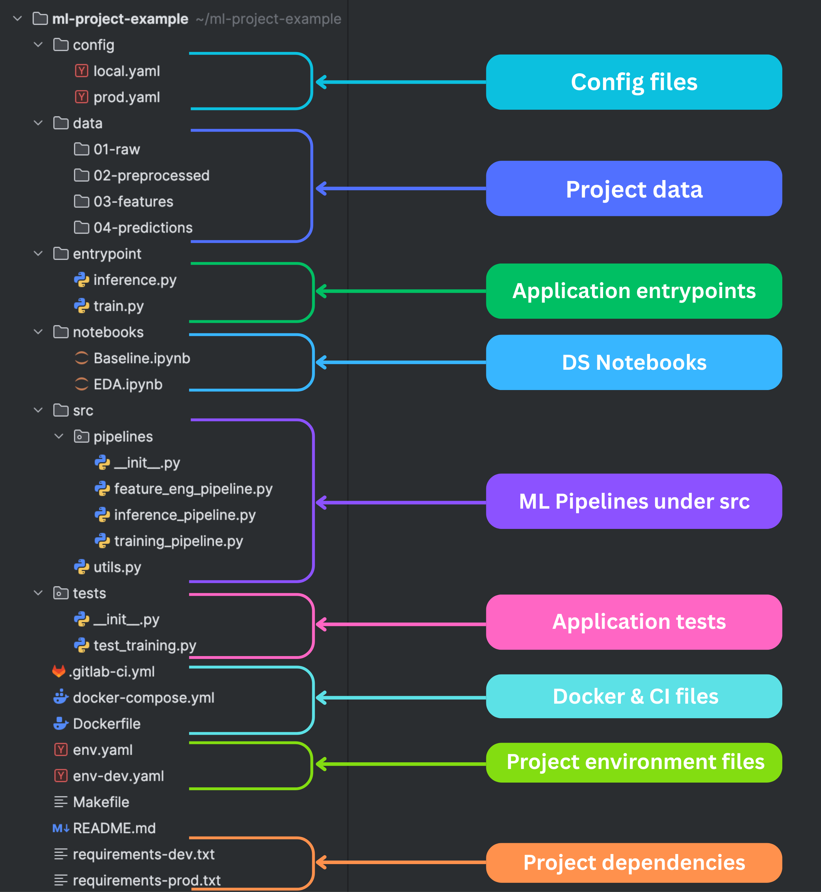

# ML Project Example  

A reference implementation of a **well-structured Machine Learning project**.  

Most ML practitioners start with notebooks and a couple of folders. It works — until the project grows. Then reproducibility breaks, pipelines become messy, and deploying models turns into chaos.  

This repository shows how to organize ML projects **like a professional software system**: modular, reproducible, and production-ready. The structure is based on lessons learned from 10+ industrial-level ML projects.  

---

## Why Project Structure Matters  

Machine learning projects aren’t just about training models. You deal with:  

- Multiple versions of datasets  
- Experimental code evolving into production workflows  
- Model artifacts that must be versioned and tracked  
- Complex pipelines from raw data to predictions  

Without structure, these complexities quickly spiral out of control.  

This repo demonstrates how to design an ML project that is **maintainable, reproducible, and ready for production**.  

---

## Project Structure
